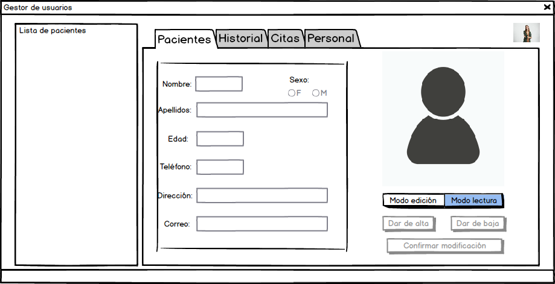
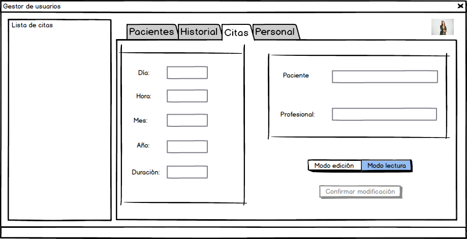
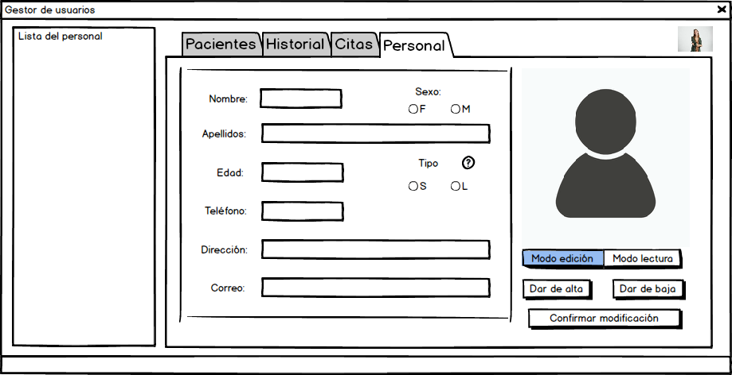

# IPO Hito 1

| **Participantes** |
| :--: |
| Noelia Díaz-Alejo Alejo |
| Antonio Campallo Gómez |
| Samuel Espejo Gil |

<!-- Línea horizontal para separar -->
---

## Índice

1. [Requisitos](#requisitos)

   1. [Permitir loguearse](#r01-autentificación-de-usuarios)

   2. [Consulta](#r02-consulta-de-datos)

   3. [Modificaciones](#r03-modificación-de-datos)

   4. [Capacidad de cambiar formatos y layout acorde al usuario (*opcional*)](#r04-adaptación-de-interfaz-de-usuario)

   5. [Altas/Bajas](#r05-creación/eliminación-de-pacientes)

2. [Bocetos](#bocetos)

<!-- Para separar en páginas al crear el PDF-->
$$\pagebreak$$

## Requisitos

<!--
Usad este doc como referencia para hacer una documentación en MarkDown (MD)
Un muy buen editor de MD es visual studio code, tiene un previsualizador y podéis encontrar extensiones para pasar a PDF
Esto es un comentario
-->

### R01 Autentificación de Usuarios

<!--
Esto es tema personal, pero me gusta que sólo haya una frase (hasta el punto) por línea.
Y los títulos estén separados por arriba y por debajo
-->

Debe permitir a los usuarios autentificarse para acceder a la aplicación a través de su cuenta.
Requiere la introducción de credenciales.
Estás consistirán en una identificación y clave.

<!-- Para separar en párrafos, dejáis una línea en blanco -->

### R02 Consulta de Datos

Debe permitir a los usuarios autorizados consultar información relacionada con los pacientes y su atención en el hospital.
Esto incluye datos personales de pacientes, historiales médicos, citas atendidas y programadas, así como la información referente al personal contratado.

### R03 Modificación de Datos

Debe permitir modificar los datos para poder actualizar la información.
Para ello, será necesario confirmar la modificación a través de un botón.

### R04 Adaptación de Interfaz de Usuario

Debe permitir a los usuarios personalizar la aplicación para satisfacer sus preferencias y necesidades.
Cambiar el tipo de fuente, tamaño, layout, etc.

### R05 Creación de Pacientes

Debe permitir a los usuarios autorizados registrar nuevos pacientes en la base de datos.

### R06 Eliminación de Pacientes

Debe permitir a los usuarios autorizados eliminar pacientes de la base de datos.

## Bocetos

<!-- En la previsualización, el link no funciona, pero una vez se exporta y SE PONE EN LA CARPETA build, el link funciona, por ser relativo -->

